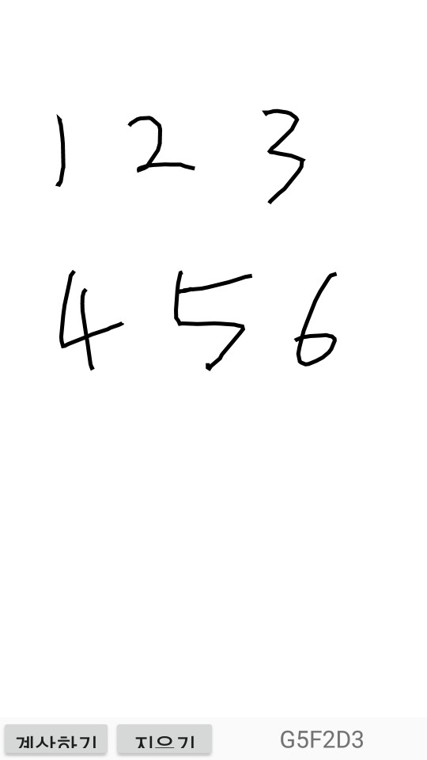

# Handwriting-Tensorflow-android

<hr>

## Requirements

1. [Link1](https://www.tensorflow.org/lite/guide/android) 를 따라서 설치 또는 [Link2](https://pythonkim.tistory.com/133?category=703510) 를 이용
2. 이 프로젝트에서는 `Keras`의 모델, Weight 파일( .h5 )을 이용 [Link](https://github.com/Shobhit20/MultiDetect-EMNIST)

<hr>

## 프로젝트 진행

1. `Keras`의 모델 및 Weight 파일을 `tflite`파일로 변환해줘야한다 - [File](converter.py) 을 이용
2. [Link](https://pythonkim.tistory.com/143?category=703510) 사이트를 참조하여 텐서라이트를 구현했다

<hr>
## 어려웠던 점

1. 안드로이드에서 `Interpreter`를 사용하여 텐서라이트를 돌리면 무슨 그림을 그려도 결과가 1이 나와서 문제점을 찾느냐고 고생했다

2. 여러가지 문제가 겹쳐있었다

   1. Opencv의 Mat 객체로 가져오는 예제를 찾지 못해 Bitmap의 값을 가져오는 걸로 시작을 했는데, 값을 이상하게 가져오는 것을 알지 못했었다 방법을 찾다가 결국 익숙한 Mat으로 가져오는 방법을 채택했다 

   2. Opencv의 Mat 객체에서 값을 가져올 때 잘못 가져와서 `0`또는 `255`가 아닌 `-1` 등 다양한 숫자가 나와서 고생했다

   3. 텐서라이트 대부분의 예제가 Byte 배열을 이용하는데 무조건 예제대로 Byte 버퍼를 이용하는 것이 아닌 다른 배열을 이용해도 된다 (Ex - float)

   4. 이것을 가장 늦게 깨달았는데, 인풋 값의 배열을 텐서라이트 모델의 인풋값의 차원과 맞춰 줘야한다
      쉽게 말해서 이 프로젝트의 경우 MNIST인 `1 x 28 x 28 x 1` 차원을 사용하는데 (텐서라이트 모델 또한 그렇다)
      안드로이드에서 인풋으로 사용하는 배열의 경우도 `1 x 28 x 28 x 1`로 선언해야한다

      ```java
      private float[][][][] Test_Img = new float[1][IMG_HEIGHT][IMG_WIDTH][NUM_CHANNEL];
      ```

      

<hr>


## 구현 이슈

1. 이전 `Tesseract`의 정확성보다 나으나 여전히 만족할 만한 수준은 아닌 것 같다

2. 다른 `Handwriting` 딥러닝 모델을 찾아서 개선해봐야 할 듯 하다 

   

<hr>