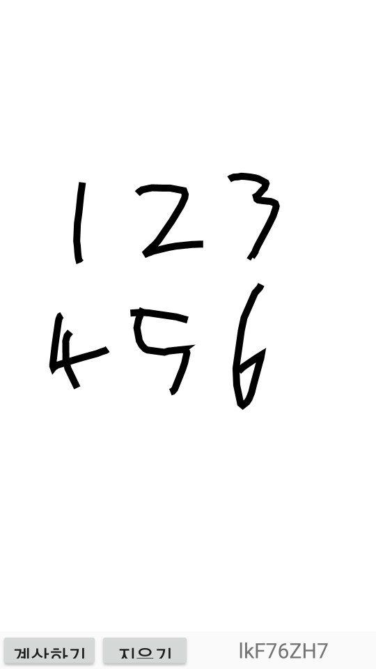

# Tesseract_android

## 어플 구성

1. Activity 하나로 구성
2. 크게 View 2개로 나뉘어짐
   1. View 1 : 글씨를 작성할 수 있는 View
   2. View 2 : 계산 버튼, 지우기 버튼, 결과 Text View 로 이루어짐

## 구현된 부분

1. 지우기 버튼이 구현된 상태
2. 작성된 글씨를 `Tesseract`를 이용하여 인식하는 부분까지 완성됨

## 구현 이슈

1. `Tesseract`의 정확성이 심각하게 떨어짐
2. `Tesseract`를 이용한 `Handwriting`을 이용할 이유가 사라짐

## Tesseract 출처

1. [Tesseract](https://github.com/rmtheis/tess-two)
2. [Tesseract_dataset](https://github.com/tesseract-ocr/tessdata_best)

